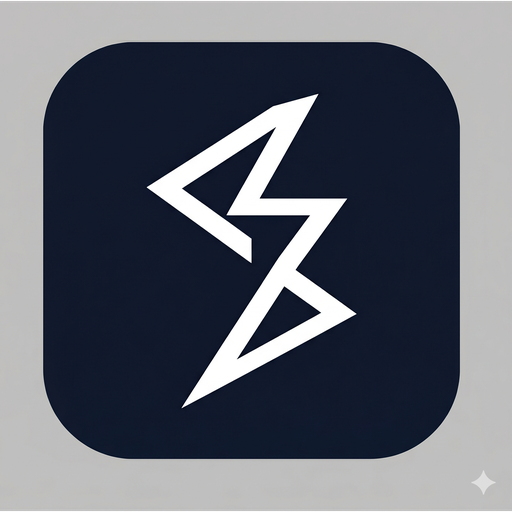

<div align="center">
  

  # 🚀 JudgeLoom

  **A Next-Generation, High-Performance Competitive Programming Online Judge Platform**

  [](https://github.com/ThanhNguyxnOrg/judgeloom-core/actions/workflows/ci.yml)
  [](https://github.com/ThanhNguyxnOrg/judgeloom-core/actions/workflows/codeql.yml)
  [](https://www.python.org/)
  [](https://www.djangoproject.com/)
  [](https://www.postgresql.org/)
  [](https://redis.io/)
  [](https://docs.astral.sh/ruff/)
  [](LICENSE)
</div>

<br />

> **JudgeLoom** is a complete, modern rewrite inspired by the classic DMOJ/VNOJ online judge platforms. It is designed from the ground up for scalability, sub-millisecond API performance, real-time WebSocket feedback, and a seamless developer experience. 

---

## ✨ Feature Highlights

* 🏆 **Native Contest Formats:** Full support for ICPC, IOI, AtCoder, and ECOO scoring formats.
* ⚡ **Real-time Judging Feedback:** Watch your submission get judged instantly via Django Channels (WebSockets).
* 📈 **Advanced Rating System:** Elo-based performance tracking, leaderboards, and historical rating graphs.
* 🛡️ **Robust Security:** Secure JWT Authentication, isolated Judge Worker sandboxing, and strict rate-limiting.
* 🧩 **Extensible Plugin Architecture:** Centralized registry to easily plug in custom contest formats or custom interactive judges.
* 🚀 **Async Processing:** High-throughput job queues powered by Celery & Redis for asynchronous judging.
* 📖 **Modern REST API:** Fully typed, auto-documented OpenAPI built with Django Ninja and Pydantic v2.

---

## 🛠️ Tech Stack

| Component | Technology | Description |
| :--- | :--- | :--- |
| **Framework** | Django 5.1+ | Core MVC framework handling DB schemas & ORM |
| **API Layer** | Django Ninja | Blazing fast REST API generation |
| **Validation** | Pydantic v2 | Strict data validation & typing |
| **Real-time** | Django Channels | WebSockets for live submission updates |
| **Task Queue** | Celery | Background processing & judge dispatching |
| **Broker/Cache** | Redis 7+ | In-memory message broker & cache |
| **Database** | PostgreSQL 16+ | Primary relational database |
| **Linting/Formatting** | Ruff | Extremely fast Python linter & code formatter |

---

## 📂 Project Structure

```text
judgeloom-core/
├── apps/                 # 📦 Modular Django applications (Domain Logic)
│   ├── accounts/         # User authentication & profiles
│   ├── contests/         # Contest management & rules
│   ├── problems/         # Problem sets & test data pipelines
│   ├── submissions/      # Submission tracking & real-time updates
│   ├── judge/            # Judge worker communication bridge
│   └── ...               # (ratings, content, tickets, etc.)
├── config/               # ⚙️ Core project settings & WSGI/ASGI configurations
├── core/                 # 🧠 Shared utilities, exceptions, and event pub/sub
├── requirements/         # 📋 Python dependency specifications
└── tests/                # 🧪 Comprehensive Pytest test suite
```

---

## 🚀 Quick Start

### 📋 Prerequisites
Make sure you have the following installed:
* Python 3.12 or higher
* PostgreSQL 16+
* Redis 7+
* Git

### 🔧 Installation & Setup

1. **Clone the repository**
   ```bash
   git clone https://github.com/ThanhNguyxnOrg/judgeloom-core.git
   cd judgeloom-core
   ```

2. **Set up a virtual environment**
   ```bash
   python -m venv venv
   
   # On macOS/Linux:
   source venv/bin/activate  
   # On Windows:
   venv\Scripts\activate
   ```

3. **Install dependencies**
   ```bash
   pip install -r requirements/base.txt -r requirements/testing.txt
   ```

4. **Configure your environment**
   ```bash
   cp .env.example .env
   ```
   *Open `.env` and fill in your database, Redis, and secret key configurations.*

5. **Initialize the database**
   ```bash
   python manage.py migrate
   python manage.py createsuperuser
   ```

6. **Run the development server**
   ```bash
   # Terminal 1: Django Server
   python manage.py runserver
   
   # Terminal 2: Celery Worker (for background judging)
   celery -A config worker -l INFO
   ```

---

## 🏛️ Architecture & Best Practices

JudgeLoom avoids the "Fat Models, Fat Views" anti-pattern by strictly enforcing the **Service Layer Pattern**:
- **Services (`services.py`):** Pure Python functions/classes holding business logic. Models and Views are kept thin.
- **Event-Driven (`core.events`):** Apps communicate via an internal Publish/Subscribe mechanism to stay decoupled.
- **Strict Typing:** All logic uses Python 3.12+ type hinting with `from __future__ import annotations`.

---

## 🧪 Development & Testing

We enforce strict code quality using `pytest` and `ruff`.

**Run the Test Suite:**
```bash
python -m pytest tests/ -v
```

**Run Linters & Formatters:**
```bash
ruff check . --fix
ruff format .
```

---

## 🤝 Contributing

We welcome contributions! See [`CONTRIBUTING.md`](./CONTRIBUTING.md) for the full workflow, coding standards, and commit conventions.

In short:
1. Fork the project.
2. Create your feature branch (`git checkout -b feat/amazing-feature`).
3. Write tests and run `make check` (lint + typecheck + tests).
4. Commit using [Conventional Commits](https://www.conventionalcommits.org/).
5. Push and open a Pull Request against `master`.

By participating, you agree to abide by our [Code of Conduct](./CODE_OF_CONDUCT.md).

---

## 🔒 Security

Please report vulnerabilities privately — see [`SECURITY.md`](./SECURITY.md). Do **not** open public issues for security problems.

---

## 📄 License

Distributed under the **GNU Affero General Public License v3.0**. See [`LICENSE`](./LICENSE) for the full text.

---
<div align="center">
  <i>Developed with ❤️ for the Competitive Programming community.</i>
</div>
